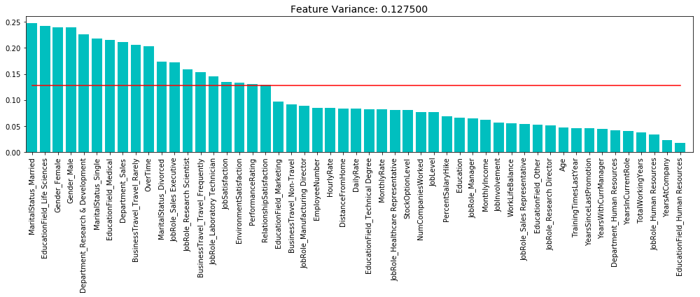
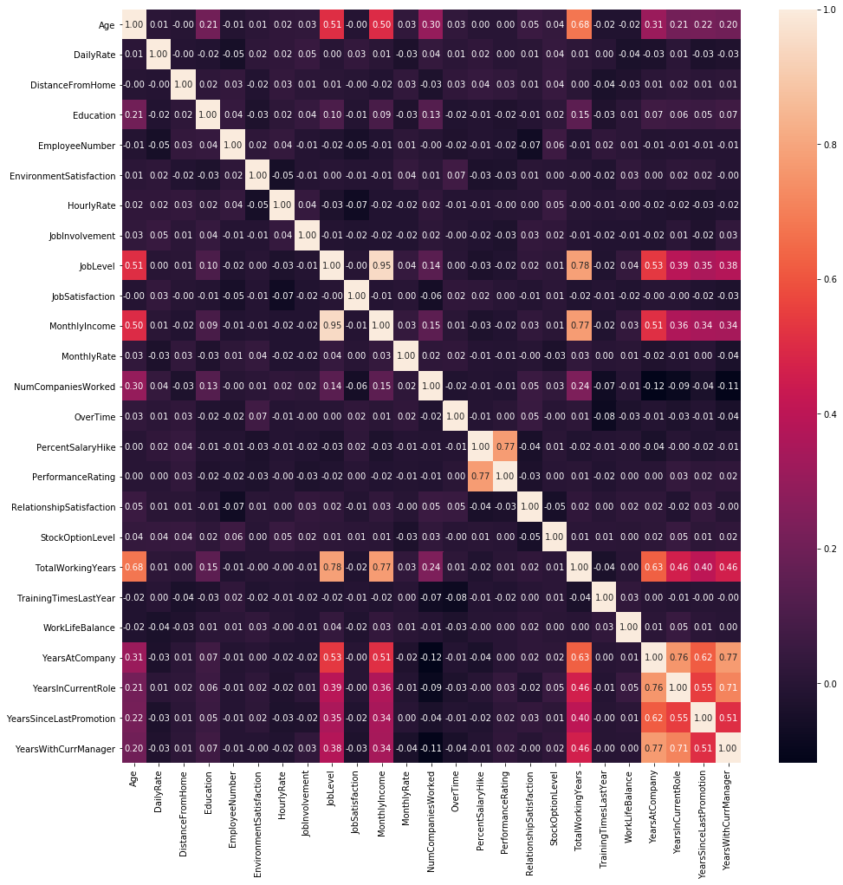
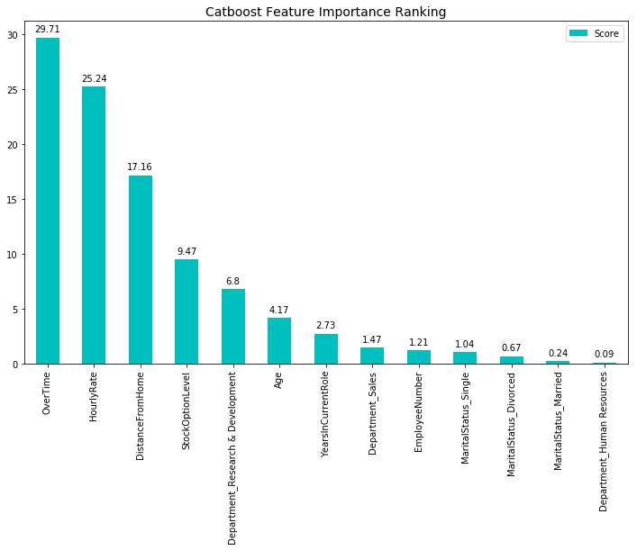

## CI6227 - Exploration of Yandex CatBoost ##

This demo will provide a brief introduction in  
- performing data exploration and preprocessing 
- introduction to feature subset selection: low variance filter
- introduction to feature subset selection: high correlation filter
- catboost model tuning 
- importance of data preprocessing: data normalization
- exploration of catboost's feature importance ranking  

Installing the open source Yandex CatBoost package


```python
pip install catboost
```

Importing the required packaged: Numpy, Pandas, Matplotlib, Seaborn, Scikit-learn and CatBoost


```python
import numpy as np
import pandas as pd
import matplotlib.pyplot as plt
# plt.style.use('ggplot') 
import seaborn as sns
from catboost import Pool, CatBoostClassifier, cv, CatboostIpythonWidget
from sklearn.preprocessing import MinMaxScaler
from sklearn.feature_selection import VarianceThreshold
```

Loading of [IBM HR Dataset](https://www.kaggle.com/pavansubhasht/ibm-hr-analytics-attrition-dataset/data) into pandas dataframe


```python
ibm_hr_df = pd.read_csv("IBM-HR-Employee-Attrition.csv")
```

### Part 1a: Data Exploration - Summary Statistics ###

Getting the summary statistics of the IBM HR dataset


```python
ibm_hr_df.describe()
```


<div>
<table class="dataframe">
  <thead>
    <tr style="text-align: right;">
      <th></th>
      <th>Age</th>
      <th>DailyRate</th>
      <th>DistanceFromHome</th>
      <th>Education</th>
      <th>EmployeeCount</th>
      <th>EmployeeNumber</th>
      <th>EnvironmentSatisfaction</th>
      <th>HourlyRate</th>
      <th>JobInvolvement</th>
      <th>JobLevel</th>
      <th>...</th>
      <th>RelationshipSatisfaction</th>
      <th>StandardHours</th>
      <th>StockOptionLevel</th>
      <th>TotalWorkingYears</th>
      <th>TrainingTimesLastYear</th>
      <th>WorkLifeBalance</th>
      <th>YearsAtCompany</th>
      <th>YearsInCurrentRole</th>
      <th>YearsSinceLastPromotion</th>
      <th>YearsWithCurrManager</th>
    </tr>
  </thead>
  <tbody>
    <tr>
      <th>count</th>
      <td>1470.000000</td>
      <td>1470.000000</td>
      <td>1470.000000</td>
      <td>1470.000000</td>
      <td>1470.0</td>
      <td>1470.000000</td>
      <td>1470.000000</td>
      <td>1470.000000</td>
      <td>1470.000000</td>
      <td>1470.000000</td>
      <td>...</td>
      <td>1470.000000</td>
      <td>1470.0</td>
      <td>1470.000000</td>
      <td>1470.000000</td>
      <td>1470.000000</td>
      <td>1470.000000</td>
      <td>1470.000000</td>
      <td>1470.000000</td>
      <td>1470.000000</td>
      <td>1470.000000</td>
    </tr>
    <tr>
      <th>mean</th>
      <td>36.923810</td>
      <td>802.485714</td>
      <td>9.192517</td>
      <td>2.912925</td>
      <td>1.0</td>
      <td>1024.865306</td>
      <td>2.721769</td>
      <td>65.891156</td>
      <td>2.729932</td>
      <td>2.063946</td>
      <td>...</td>
      <td>2.712245</td>
      <td>80.0</td>
      <td>0.793878</td>
      <td>11.279592</td>
      <td>2.799320</td>
      <td>2.761224</td>
      <td>7.008163</td>
      <td>4.229252</td>
      <td>2.187755</td>
      <td>4.123129</td>
    </tr>
    <tr>
      <th>std</th>
      <td>9.135373</td>
      <td>403.509100</td>
      <td>8.106864</td>
      <td>1.024165</td>
      <td>0.0</td>
      <td>602.024335</td>
      <td>1.093082</td>
      <td>20.329428</td>
      <td>0.711561</td>
      <td>1.106940</td>
      <td>...</td>
      <td>1.081209</td>
      <td>0.0</td>
      <td>0.852077</td>
      <td>7.780782</td>
      <td>1.289271</td>
      <td>0.706476</td>
      <td>6.126525</td>
      <td>3.623137</td>
      <td>3.222430</td>
      <td>3.568136</td>
    </tr>
    <tr>
      <th>min</th>
      <td>18.000000</td>
      <td>102.000000</td>
      <td>1.000000</td>
      <td>1.000000</td>
      <td>1.0</td>
      <td>1.000000</td>
      <td>1.000000</td>
      <td>30.000000</td>
      <td>1.000000</td>
      <td>1.000000</td>
      <td>...</td>
      <td>1.000000</td>
      <td>80.0</td>
      <td>0.000000</td>
      <td>0.000000</td>
      <td>0.000000</td>
      <td>1.000000</td>
      <td>0.000000</td>
      <td>0.000000</td>
      <td>0.000000</td>
      <td>0.000000</td>
    </tr>
    <tr>
      <th>25%</th>
      <td>30.000000</td>
      <td>465.000000</td>
      <td>2.000000</td>
      <td>2.000000</td>
      <td>1.0</td>
      <td>491.250000</td>
      <td>2.000000</td>
      <td>48.000000</td>
      <td>2.000000</td>
      <td>1.000000</td>
      <td>...</td>
      <td>2.000000</td>
      <td>80.0</td>
      <td>0.000000</td>
      <td>6.000000</td>
      <td>2.000000</td>
      <td>2.000000</td>
      <td>3.000000</td>
      <td>2.000000</td>
      <td>0.000000</td>
      <td>2.000000</td>
    </tr>
    <tr>
      <th>50%</th>
      <td>36.000000</td>
      <td>802.000000</td>
      <td>7.000000</td>
      <td>3.000000</td>
      <td>1.0</td>
      <td>1020.500000</td>
      <td>3.000000</td>
      <td>66.000000</td>
      <td>3.000000</td>
      <td>2.000000</td>
      <td>...</td>
      <td>3.000000</td>
      <td>80.0</td>
      <td>1.000000</td>
      <td>10.000000</td>
      <td>3.000000</td>
      <td>3.000000</td>
      <td>5.000000</td>
      <td>3.000000</td>
      <td>1.000000</td>
      <td>3.000000</td>
    </tr>
    <tr>
      <th>75%</th>
      <td>43.000000</td>
      <td>1157.000000</td>
      <td>14.000000</td>
      <td>4.000000</td>
      <td>1.0</td>
      <td>1555.750000</td>
      <td>4.000000</td>
      <td>83.750000</td>
      <td>3.000000</td>
      <td>3.000000</td>
      <td>...</td>
      <td>4.000000</td>
      <td>80.0</td>
      <td>1.000000</td>
      <td>15.000000</td>
      <td>3.000000</td>
      <td>3.000000</td>
      <td>9.000000</td>
      <td>7.000000</td>
      <td>3.000000</td>
      <td>7.000000</td>
    </tr>
    <tr>
      <th>max</th>
      <td>60.000000</td>
      <td>1499.000000</td>
      <td>29.000000</td>
      <td>5.000000</td>
      <td>1.0</td>
      <td>2068.000000</td>
      <td>4.000000</td>
      <td>100.000000</td>
      <td>4.000000</td>
      <td>5.000000</td>
      <td>...</td>
      <td>4.000000</td>
      <td>80.0</td>
      <td>3.000000</td>
      <td>40.000000</td>
      <td>6.000000</td>
      <td>4.000000</td>
      <td>40.000000</td>
      <td>18.000000</td>
      <td>15.000000</td>
      <td>17.000000</td>
    </tr>
  </tbody>
</table>
<p>8 rows × 26 columns</p>
</div>


Zooming in on the summary statistics of irrelevant attributes __*EmployeeCount*__ and __*StandardHours*__


```python
irrList = ['EmployeeCount', 'StandardHours'] 
ibm_hr_df[irrList].describe()
```


<div>
<table class="dataframe">
  <thead>
    <tr style="text-align: right;">
      <th></th>
      <th>EmployeeCount</th>
      <th>StandardHours</th>
    </tr>
  </thead>
  <tbody>
    <tr>
      <th>count</th>
      <td>1470.0</td>
      <td>1470.0</td>
    </tr>
    <tr>
      <th>mean</th>
      <td>1.0</td>
      <td>80.0</td>
    </tr>
    <tr>
      <th>std</th>
      <td>0.0</td>
      <td>0.0</td>
    </tr>
    <tr>
      <th>min</th>
      <td>1.0</td>
      <td>80.0</td>
    </tr>
    <tr>
      <th>25%</th>
      <td>1.0</td>
      <td>80.0</td>
    </tr>
    <tr>
      <th>50%</th>
      <td>1.0</td>
      <td>80.0</td>
    </tr>
    <tr>
      <th>75%</th>
      <td>1.0</td>
      <td>80.0</td>
    </tr>
    <tr>
      <th>max</th>
      <td>1.0</td>
      <td>80.0</td>
    </tr>
  </tbody>
</table>
</div>


Zooming in on the summary statistics of irrelevant attribute __*Over18*__ 


```python
ibm_hr_df["Over18"].value_counts()
```


    Y    1470
    Name: Over18, dtype: int64


From the summary statistics, one could see that attributes __*EmployeeCount*__, __*StandardHours*__ and __*Over18*__ holds only one single value for all of the 1470 records <br>

__*EmployeeCount*__ only holds a single value - 1.0 <br>
__*StandardHours*__ only holds a single value - 80.0 <br>
__*Over18*__        only holds a single value - 'Y'  <br>

These irrelevant attributes are duely dropped from the dataset

### Part 1b: Data Exploration - Missing Values and Duplicate Records ###

Checking for 'NA' and missing values in the dataset.


```python
ibm_hr_df.isnull().sum(axis=0)
```


    Age                         0
    Attrition                   0
    BusinessTravel              0
    DailyRate                   0
    Department                  0
    DistanceFromHome            0
    Education                   0
    EducationField              0
    EmployeeCount               0
    EmployeeNumber              0
    EnvironmentSatisfaction     0
    Gender                      0
    HourlyRate                  0
    JobInvolvement              0
    JobLevel                    0
    JobRole                     0
    JobSatisfaction             0
    MaritalStatus               0
    MonthlyIncome               0
    MonthlyRate                 0
    NumCompaniesWorked          0
    Over18                      0
    OverTime                    0
    PercentSalaryHike           0
    PerformanceRating           0
    RelationshipSatisfaction    0
    StandardHours               0
    StockOptionLevel            0
    TotalWorkingYears           0
    TrainingTimesLastYear       0
    WorkLifeBalance             0
    YearsAtCompany              0
    YearsInCurrentRole          0
    YearsSinceLastPromotion     0
    YearsWithCurrManager        0
    dtype: int64


Well, we got lucky here, there isn't any missing values in this dataset

Next, let's check for the existence of duplicate records in the dataset


```python
ibm_hr_df.duplicated().sum()
```


    0


There are also no duplicate records in the dataset

Converting __*OverTime*__ binary categorical attribute to {1, 0}


```python
ibm_hr_df['OverTime'].replace(to_replace=dict(Yes=1, No=0), inplace=True)
```

### Part 2a: Data Preprocessing - Removal of Irrelevant Attributes ###


```python
ibm_hr_df = ibm_hr_df.drop(['EmployeeCount', 'StandardHours', 'Over18'], axis=1)
```

### Part 2b: Data Preprocessing - Feature Subset Selection - Low Variance Filter  ###

Performing variance analysis to aid in feature selection


```python
variance_x = ibm_hr_df.drop('Attrition', axis=1)
variance_one_hot = pd.get_dummies(variance_x)
```


```python
#Normalise the dataset. This is required for getting the variance threshold
scaler = MinMaxScaler()
scaler.fit(variance_one_hot)
MinMaxScaler(copy=True, feature_range=(0, 1))
scaled_variance_one_hot = scaler.transform(variance_one_hot)
```


```python
#Set the threshold values and run VarianceThreshold 
thres = .85* (1 - .85)
sel = VarianceThreshold(threshold=thres)
sel.fit(scaled_variance_one_hot)
variance = sel.variances_
```


```python
#Sorting of the score in acsending orders for plotting
indices = np.argsort(variance)[::-1]
feature_list = list(variance_one_hot)
sorted_feature_list = []
thres_list = []
for f in range(len(variance_one_hot.columns)):
    sorted_feature_list.append(feature_list[indices[f]])
    thres_list.append(thres)
```


```python
plt.figure(figsize=(14,6))
plt.title("Feature Variance: %f" %(thres), fontsize = 14)
plt.bar(range(len(variance_one_hot.columns)), variance[indices], color="c")
plt.xticks(range(len(variance_one_hot.columns)), sorted_feature_list, rotation = 90)
plt.xlim([-0.5, len(variance_one_hot.columns)])
plt.plot(range(len(variance_one_hot.columns)), thres_list, "k-", color="r")
plt.tight_layout()
plt.show()
```





### Part 2c: Data Preprocessing - Feature Subset Selection - High Correlation Filter  ###

Performing Pearson correlation analysis between attributes to aid in feature selection


```python
plt.figure(figsize=(16,16))
sns.heatmap(ibm_hr_df.corr(), annot=True, fmt=".2f")

plt.show()
```





### Part 3: Mutli-Class Label Generation ###


```python
rAttrList = ['Department', 'OverTime', 'HourlyRate',
             'StockOptionLevel', 'DistanceFromHome',
             'YearsInCurrentRole', 'Age']
```


```python
#keep only the attribute list on rAttrList
label_hr_df = ibm_hr_df[rAttrList]
```


```python
#convert continous attribute DistanceFromHome to Catergorical
#: 1: near, 2: mid distance, 3: far
maxValues = label_hr_df['DistanceFromHome'].max()
minValues = label_hr_df['DistanceFromHome'].min()
intervals = (maxValues - minValues)/3
bins = [0, (minValues + intervals), (maxValues - intervals), maxValues]
groupName = [1, 2, 3]
label_hr_df['CatDistanceFromHome'] = pd.cut(label_hr_df['DistanceFromHome'], bins, labels = groupName)
```


```python
# convert col type from cat to int64
label_hr_df['CatDistanceFromHome'] = pd.to_numeric(label_hr_df['CatDistanceFromHome']) 
label_hr_df.drop(['DistanceFromHome'], axis = 1, inplace = True)
```


```python
#replace department into 0 & 1, 0: R&D, and 1: Non-R&D
label_hr_df['Department'].replace(['Research & Development', 'Human Resources', 'Sales'],
                                  [0, 1, 1], inplace = True)
```


```python
#normalise data
label_hr_df_norm = (label_hr_df - label_hr_df.min()) / (label_hr_df.max() - label_hr_df.min())
```


```python
#create a data frame for the function value and class labels
value_df = pd.DataFrame(columns = ['ClassValue'])
```


```python
#compute the class value
for row in range (0, ibm_hr_df.shape[0]):
    if label_hr_df_norm['Department'][row] == 0:
        value = 0.3 * label_hr_df_norm['HourlyRate'][row] - 0.2 * label_hr_df_norm['OverTime'][row] + \
            - 0.2 * label_hr_df_norm['CatDistanceFromHome'][row] + 0.15 * label_hr_df_norm['StockOptionLevel'][row] + \
            0.1 * label_hr_df_norm['Age'][row] - 0.05 * label_hr_df_norm['YearsInCurrentRole'][row]
    
    else:
        value = 0.2 * label_hr_df_norm['HourlyRate'][row] - 0.3 * label_hr_df_norm['OverTime'][row] + \
            - 0.15 * label_hr_df_norm['CatDistanceFromHome'][row] + 0.2 * label_hr_df_norm['StockOptionLevel'][row] + \
            0.05 * label_hr_df_norm['Age'][row] - 0.1 * label_hr_df_norm['YearsInCurrentRole'][row]
    value_df.loc[row] = value
```


```python
# top 500 highest class value is satisfied with their job
v1 = value_df.sort_values('ClassValue', ascending = False).reset_index(drop = True)\
        ['ClassValue'][499]
# next top 500 is neutral
v2 = value_df.sort_values('ClassValue', ascending = False).reset_index(drop = True)\
        ['ClassValue'][999]
# rest is unsatisfied
```


```python
label_df = pd.DataFrame(columns = ['ClassLabel'])
```


```python
#compute the classlabel
for row in range (0, value_df.shape[0]):
    if value_df['ClassValue'][row] >= v1:
        cat = "Satisfied"
    elif value_df['ClassValue'][row] >= v2:
        cat = "Neutral"
    else:
        cat = "Unsatisfied"
    label_df.loc[row] = cat
```


```python
df = pd.concat([ibm_hr_df, label_df], axis = 1)
```

### Part 4: Classification with CatBoost ###


```python
df = df[['Age', 'Department', 'DistanceFromHome', 'HourlyRate', 'OverTime', 'StockOptionLevel', 
         'MaritalStatus', 'YearsInCurrentRole', 'EmployeeNumber', 'ClassLabel']]
```

Split dataset into attributes/features __*X*__ and label/class __*y*__


```python
X = df.drop('ClassLabel', axis=1)
y = df.ClassLabel
```

Replacing label/class value from __*'Satisfied'*__, __*'Neutral'*__ and *__'Unsatisfied'__* to *__2__*, __*1*__ and __*0*__


```python
y.replace(to_replace=dict(Satisfied=2, Neutral=1, Unsatisfied=0), inplace=True)
```

Performing __'one hot encoding'__ method


```python
one_hot = pd.get_dummies(X)
```

```python
categorical_features_indices = np.where(one_hot.dtypes != np.float)[0]
```

### Part 5: Model training with CatBoost ###
Now lets split our data to train (70%) and test (30%) set:


```python
from sklearn.model_selection import train_test_split

X_train, X_test, y_train, y_test = train_test_split(one_hot, y, train_size=0.7, random_state=1234)
```


```python
model = CatBoostClassifier(
    custom_loss = ['Accuracy'],
    random_seed = 100,
    loss_function = 'MultiClass'
)
```


```python
model.fit(
    X_train, y_train,
    cat_features = categorical_features_indices,
    verbose = True,  # you can uncomment this for text output
    #plot = True
)
```


```python
cm = pd.DataFrame()
cm['Satisfaction'] = y_test
cm['Predict'] = model.predict(X_test)
```


```python
mappingSatisfaction = {0:'Unsatisfied', 1: 'Neutral', 2: 'Satisfied'}
mappingPredict = {0.0:'Unsatisfied', 1.0: 'Neutral', 2.0: 'Satisfied'}
cm = cm.replace({'Satisfaction': mappingSatisfaction, 'Predict': mappingPredict})
```


```python
pd.crosstab(cm['Satisfaction'], cm['Predict'], margins=True)
```


<div>
<table class="dataframe">
  <thead>
    <tr style="text-align: right;">
      <th>Predict</th>
      <th>Neutral</th>
      <th>Satisfied</th>
      <th>Unsatisfied</th>
      <th>All</th>
    </tr>
    <tr>
      <th>Satisfaction</th>
      <th></th>
      <th></th>
      <th></th>
      <th></th>
    </tr>
  </thead>
  <tbody>
    <tr>
      <th>Neutral</th>
      <td>143</td>
      <td>8</td>
      <td>8</td>
      <td>159</td>
    </tr>
    <tr>
      <th>Satisfied</th>
      <td>20</td>
      <td>123</td>
      <td>1</td>
      <td>144</td>
    </tr>
    <tr>
      <th>Unsatisfied</th>
      <td>18</td>
      <td>0</td>
      <td>120</td>
      <td>138</td>
    </tr>
    <tr>
      <th>All</th>
      <td>181</td>
      <td>131</td>
      <td>129</td>
      <td>441</td>
    </tr>
  </tbody>
</table>
</div>


```python
model.score(X_test, y_test)
```


    0.87528344671201819


### Part 6: CatBoost Classifier Tuning ###


```python
model = CatBoostClassifier(
    l2_leaf_reg = 5,
    iterations = 1000,
    fold_len_multiplier = 1.1,
    custom_loss = ['Accuracy'],
    random_seed = 100,
    loss_function = 'MultiClass'
)
```


```python
model.fit(
    X_train, y_train,
    cat_features = categorical_features_indices,
    verbose = True,  # you can uncomment this for text output
    #plot = True
)
```


```python
cm = pd.DataFrame()
cm['Satisfaction'] = y_test
cm['Predict'] = model.predict(X_test)
```


```python
mappingSatisfaction = {0:'Unsatisfied', 1: 'Neutral', 2: 'Satisfied'}
mappingPredict = {0.0:'Unsatisfied', 1.0: 'Neutral', 2.0: 'Satisfied'}
cm = cm.replace({'Satisfaction': mappingSatisfaction, 'Predict': mappingPredict})
```


```python
pd.crosstab(cm['Satisfaction'], cm['Predict'], margins=True)
```


<div>
<table class="dataframe">
  <thead>
    <tr style="text-align: right;">
      <th>Predict</th>
      <th>Neutral</th>
      <th>Satisfied</th>
      <th>Unsatisfied</th>
      <th>All</th>
    </tr>
    <tr>
      <th>Satisfaction</th>
      <th></th>
      <th></th>
      <th></th>
      <th></th>
    </tr>
  </thead>
  <tbody>
    <tr>
      <th>Neutral</th>
      <td>142</td>
      <td>9</td>
      <td>8</td>
      <td>159</td>
    </tr>
    <tr>
      <th>Satisfied</th>
      <td>17</td>
      <td>126</td>
      <td>1</td>
      <td>144</td>
    </tr>
    <tr>
      <th>Unsatisfied</th>
      <td>12</td>
      <td>0</td>
      <td>126</td>
      <td>138</td>
    </tr>
    <tr>
      <th>All</th>
      <td>171</td>
      <td>135</td>
      <td>135</td>
      <td>441</td>
    </tr>
  </tbody>
</table>
</div>


```python
model.score(X_test, y_test)
```


    0.89342403628117917


### Part 7: Data Preprocessing: Attributes Value Normalization ###


Normalization of features, after realizing that tuning no longer improve model's accuracy 


```python
one_hot = (one_hot - one_hot.mean()) / (one_hot.max() - one_hot.min())
```


```python
categorical_features_indices = np.where(one_hot.dtypes != np.float)[0]
```


```python
from sklearn.model_selection import train_test_split

X_train, X_test, y_train, y_test = train_test_split(one_hot, y, train_size=0.7, random_state=1234)
```


```python
model = CatBoostClassifier(
    l2_leaf_reg = 5,
    iterations = 1000,
    fold_len_multiplier = 1.1,
    custom_loss = ['Accuracy'],
    random_seed = 100,
    loss_function = 'MultiClass'
)
```


```python
model.fit(
    X_train, y_train,
    cat_features = categorical_features_indices,
    verbose = True,  # you can uncomment this for text output
    #plot = True
)
```


```python
feature_score = pd.DataFrame(list(zip(one_hot.dtypes.index, model.get_feature_importance(Pool(one_hot, label=y, cat_features=categorical_features_indices)))),
                columns=['Feature','Score'])
```


```python
feature_score = feature_score.sort_values(by='Score', ascending=False, inplace=False, kind='quicksort', na_position='last')
```


```python
plt.rcParams["figure.figsize"] = (12,7)
ax = feature_score.plot('Feature', 'Score', kind='bar', color='c')
ax.set_title("Catboost Feature Importance Ranking", fontsize = 14)
ax.set_xlabel('')

rects = ax.patches

# get feature score as labels round to 2 decimal
labels = feature_score['Score'].round(2)

for rect, label in zip(rects, labels):
    height = rect.get_height()
    ax.text(rect.get_x() + rect.get_width()/2, height + 0.35, label, ha='center', va='bottom')

plt.show()
```





```python
cm = pd.DataFrame()
cm['Satisfaction'] = y_test
cm['Predict'] = model.predict(X_test)
```


```python
mappingSatisfaction = {0:'Unsatisfied', 1: 'Neutral', 2: 'Satisfied'}
mappingPredict = {0.0:'Unsatisfied', 1.0: 'Neutral', 2.0: 'Satisfied'}
cm = cm.replace({'Satisfaction': mappingSatisfaction, 'Predict': mappingPredict})
```


```python
pd.crosstab(cm['Satisfaction'], cm['Predict'], margins=True)
```


<div>
<table class="dataframe">
  <thead>
    <tr style="text-align: right;">
      <th>Predict</th>
      <th>Neutral</th>
      <th>Satisfied</th>
      <th>Unsatisfied</th>
      <th>All</th>
    </tr>
    <tr>
      <th>Satisfaction</th>
      <th></th>
      <th></th>
      <th></th>
      <th></th>
    </tr>
  </thead>
  <tbody>
    <tr>
      <th>Neutral</th>
      <td>146</td>
      <td>11</td>
      <td>2</td>
      <td>159</td>
    </tr>
    <tr>
      <th>Satisfied</th>
      <td>7</td>
      <td>137</td>
      <td>0</td>
      <td>144</td>
    </tr>
    <tr>
      <th>Unsatisfied</th>
      <td>8</td>
      <td>0</td>
      <td>130</td>
      <td>138</td>
    </tr>
    <tr>
      <th>All</th>
      <td>161</td>
      <td>148</td>
      <td>132</td>
      <td>441</td>
    </tr>
  </tbody>
</table>
</div>


```python
model.score(X_test, y_test)
```


    0.93650793650793651


### Future Improvements ###

Results from the feature importance ranking shows that attribute ‘MaritalStatus’ impacts minimally in class label prediction and could potential be a noise attribute. Removing it might increase model’s accuracy.    
